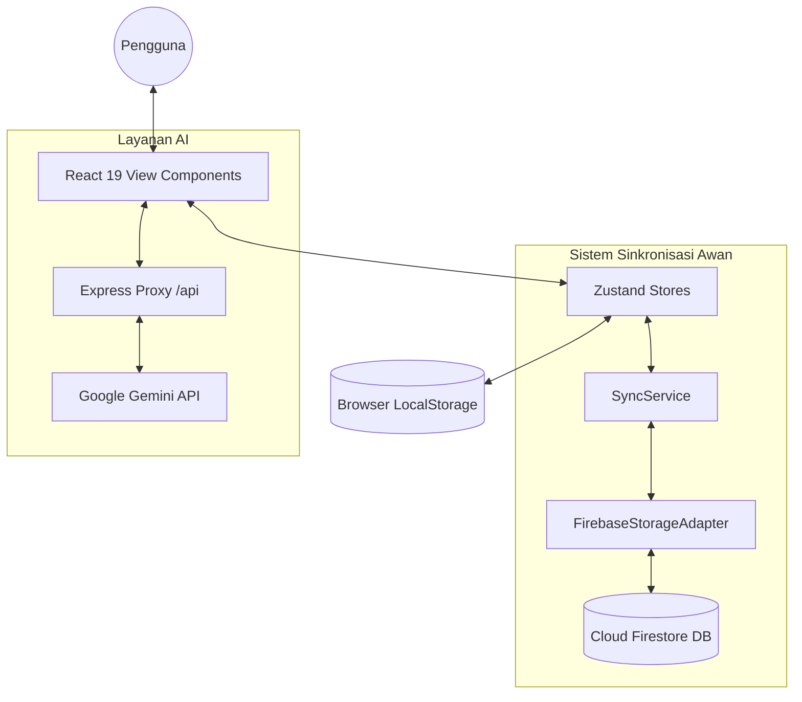

# MoodBloom - System Context & Development Log

Welcome to the master documentation file for **MoodBloom**. This file consolidates the product requirements (PRD), workspace instructions, architectural glossary, detailed engineering report, and the complete historical tracking log. It is designed to give AI agents and developers a comprehensive, self-contained understanding of the entire codebase and project context.

---

## Table of Contents
1. [Overview & Product Requirements](#1-overview--product-requirements)
2. [Workspace Instructions & Tech Stack Rules](#2-workspace-instructions--tech-stack-rules)
3. [Domain Terminology & Architectural Concepts](#3-domain-terminology--architectural-concepts)
4. [Detailed Engineering & Implementation Report](#4-detailed-engineering--implementation-report)
   - [Data Modeling & Preprocessing](#data-modeling--preprocessing)
   - [AI Modeling & Context Grounding](#ai-modeling--context-grounding)
   - [Local-First Sync Architecture](#local-first-sync-architecture)
   - [UI/UX Bento Grid & Adaptive Aura](#uiux-bento-grid--adaptive-aura)
   - [Code Snippets](#code-snippets)
5. [Project Development Tracking Log](#5-project-development-tracking-log)

---

## 1. Overview & Product Requirements

### 1.1 Overview
MoodBloom is a wellness-tracker web application built for university students to manage their physical and mental health. It features an **Adaptive Aura** design system—a permanently light, high-fidelity interface that automatically synchronizes its accent colors with the user's emotional state.

### 1.2 Target Audience
University students in Indonesia managing academic stress, workload, and health.

### 1.3 Core Features
1.  **Dashboard (The Daily 5)**: Track daily water intake, step count, meditation time, completed tasks, and logged prayers.
2.  **Jadwal (Schedule)**: Manage class schedules and academic tasks.
3.  **Local Insight Engine**: A privacy-focused, offline-capable heuristic engine that generates contextual wellness summaries on the Home, Water, and Mood tabs. It analyzes cross-metric trends (e.g., mood vs. sleep, hydration vs. heat) to provide actionable nudges without external API calls for primary insights.
4.  **Hydration System**: Production-grade water tracker with:
    *   **Detailed Session Logging**: Stores individual timestamps, amounts, and vessel types.
    *   **Dynamic Heat Scaling**: Automatically increases hydration goals based on local real-time temperature data.
    *   **Interactive Liquid UI**: Uses SVG/Motion wave animations to visually represent water levels.
    *   **Session Management**: Full history log with deletion capabilities for data accuracy.
5.  **Zen Oasis 2.0 (Meditation)**: An immersive, distraction-free meditation environment featuring:
    *   **Liquid Breathing Guide**: A morphing SVG engine for 4-7-8 breathing techniques.
    *   **Cinematic Atmosphere**: Moving starfields, aura orbs, and dynamic soundscape icons.
    *   **Adaptive Haptics**: Tactile feedback synchronized with inhalation and exhalation.
6.  **Oasis Sensory Engine**: A full-fidelity local audio system replacing external placeholders. Includes high-quality lo-fi focus tracks, ambient nature sounds, and tactile auditory rewards (Achievement/Success sounds) for all logging actions.
7.  **Insights (Stats)**: Visual representation of past data and progress over 7 days.
8.  **Gamification**: Streak counts and achievements (e.g., 'Tetesan Pertama', 'Master Fokus').
9.  **Authentication & Cloud Sync**: Firebase Auth and Firestore for real-time multi-device sync.

### 1.4 Technical Stack
*   **Frontend**: React 19, Vite, Tailwind CSS 4, Zustand (sliced architecture), Lucide React (icons), Motion (animations).
*   **Backend/API**: Express (Node.js) handling Gemini API integration and Strava token exchanges.
*   **Database/Auth**: Firebase (Firestore, Auth).

---

## 2. Workspace Instructions & Tech Stack Rules

These are developer rules that must be followed when updating the codebase.

### 2.1 Tech Stack Rules
*   **UI**: React 19, Tailwind CSS 4, Motion, Lucide-React.
*   **State**: Zustand with persist middleware.
*   **Cloud**: Firebase (Auth, Firestore).
*   **AI**: Node.js Express server acting as a proxy to Gemini API (`server.ts`).

### 2.2 Project Memory & Tracking Protocol
*   You must keep the master context documentation up to date when introducing new features.
*   You must append a new entry to the [Project Development Tracking Log](#5-project-development-tracking-log) whenever you complete a task, fix a bug, or make architectural changes.

---

## 3. Domain Terminology & Architectural Concepts

To maintain language consistency across AI agents, use the following terms:

*   **SyncService**: An independent service observing state via `store.subscribe()` outside the React render cycle to manage the syncing lifecycle (debouncing, batching).
    *   *Avoid*: FirebaseSync, SyncHook, SyncComponent
*   **CloudStorageAdapter**: An interface that the `SyncService` depends on to push and pull data, allowing for different implementations (like `FirebaseStorageAdapter` or `InMemoryStorageAdapter`). Provides generic collection subscriptions and batch writes.
    *   *Avoid*: DatabaseConnection, FirebaseInstance
*   **SyncOperation**: A generic data structure representing a write or delete action, passed from the `SyncService` to the `CloudStorageAdapter`.
    *   *Avoid*: FirebaseBatch, DBQuery
*   **MergeStrategy**: A collection-specific set of rules inside `SyncService` or `syncStores` used to resolve conflicts between local state and incoming remote data (e.g., LWW for tasks/settings, array-merging for steps).
    *   *Avoid*: GlobalResolver, ConflictHandler
*   **CustomLLMAdapter**: A server-side routing adapter in `server.ts` that formats and forwards prompts to an OpenAI-compatible self-hosted AI model (e.g., Ollama or custom local server) using configuration environment variables.
    *   *Avoid*: OllamaClient, CustomClient
*   **LocalFallbackEngine**: The local offline heuristic engine (`heuristicInsightEngine.ts`) that runs wellness assessment algorithms and sentiment rules on-device when remote AI adapters are offline or disabled.
    *   *Avoid*: LocalAI, OfflineHeuristics
*   **LocalRuleCoach**: An offline, client-side rule-based conversational agent (`localRuleCoach.ts`) that evaluates the user's message keywords in combination with their daily health metrics to generate tailored, context-aware coaching advice and actionable wellness recommendations.
    *   *Avoid*: StaticFAQ, ClientLLM, OfflineChatbot

---

## 4. Detailed Engineering & Implementation Report

### 4.1 Executive Summary
MoodBloom is a local-first application designed to help university students manage stress and routines. Primed to work offline, it stores metrics locally in `localStorage` and synchronizes to Cloud Firestore. 

### 4.2 Data Modeling & Preprocessing
The application handles five main categories of data:
1.  **Water Logs**: Milliliters logged per vessel type with full historical detail.
2.  **Steps Logs**: Movement metrics loaded from browser accelerometers or Strava OAuth sync.
3.  **Mood Logs**: Scale of 1 to 4 with textual reflection journals.
4.  **Schedules**: Academic courses and tasks.
5.  **Focus Logs**: Timestamps of Pomodoro focus blocks.

To prevent data corruption:
*   Inputs are bounds-checked (e.g. `Math.max(0, amount)`).
*   Unique UUIDs are assigned to detailed entries (like steps) to prevent duplicate sync increments.
*   Firestore security rules validate schema types (e.g. enforcing numeric steps data).

### 4.3 AI Modeling & Context Grounding
*   **Hybrid AI Approach**: Leverages `gemini-2.5-flash` via server-side Express proxy. If the Gemini API is offline, it seamlessly falls back to the client-side `localRuleCoach.ts`.
*   **Context Grounding**: Before sending requests to Gemini, the client constructs a health metrics context block (`generateUserContextBlob`). This grounding data is appended to the system prompt, keeping AI responses highly accurate and context-aware.
*   **Thinking Budget**: Set to `0` for fast, sub-second responses.
*   **Local Sentiment Analysis**: Parses notes for negative/positive keyword matches to trigger real-time, empathetic mindfulness suggestions on the frontend.

### 4.4 Local-First Sync Architecture
Below is the system communication flow:



*   **Zustand Store Slices**: Separate stores exist for user, habits, settings, and productivity, minimizing component re-renders.
*   **Event Bus**: A pub/sub bus (`eventBus.ts`) decouples cross-store mutations (e.g., locking achievements upon logging water without store circular dependencies).

### 4.5 UI/UX Bento Grid & Adaptive Aura
*   **Aura Themes**: Dynamic accent classes are pushed to the HTML root (e.g., `theme-orange`, `theme-purple`) depending on today's mood value, altering Tailwind variable colors instantly.
*   **Corner Radii Cap**: Elements conform to a `rounded-2xl` max border radius for a modern and neat visual rhythm.

### 4.6 Code Snippets

#### Conflict Resolution (syncStores.ts)
```typescript
function mergeSteps(localState: any, incomingHabits: any) {
  const localDetailed = localState.detailedStepsLogs || {};
  const incomingDetailed = incomingHabits.detailedStepsLogs || {};
  
  const mergedDetailed: any = {};
  const mergedStepsLogs: any = {};

  const allDates = new Set([
    ...Object.keys(localDetailed),
    ...Object.keys(incomingDetailed)
  ]);

  for (const date of allDates) {
    const localList = localDetailed[date] || [];
    const incomingList = incomingDetailed[date] || [];

    const mergedList = [...localList];
    for (const item of incomingList) {
      if (!mergedList.some(x => x.id === item.id)) {
        mergedList.push(item);
      }
    }

    mergedList.sort((a: any, b: any) => new Date(a.timestamp).getTime() - new Date(b.timestamp).getTime());
    
    mergedDetailed[date] = mergedList;
    mergedStepsLogs[date] = mergedList.reduce((sum: number, entry: any) => sum + entry.amount, 0);
  }

  return { mergedDetailed, mergedStepsLogs };
}
```

#### Offline Local Coach (localRuleCoach.ts)
```typescript
export function getLocalChatResponse(message: string, state: WellnessStateSnapshot): string {
  const lowerMsg = message.toLowerCase();
  const today = getTodayDateString();
  const userName = state.userName || "Sobat";

  const waterToday = state.waterLogs[today] || 0;
  const stepsToday = state.stepsLogs[today] || 0;
  const pendingTasks = state.tasks.filter((t: any) => !t.completed);

  let response = `Halo ${userName}! Maaf, saat ini saya tidak terhubung ke internet. `;

  if (lowerMsg.includes("minum") || lowerMsg.includes("air")) {
    response += `Hari ini kamu baru minum ${waterToday} ml dari target ${state.baseWaterGoal * 1000} ml. `;
    if (waterToday < (state.baseWaterGoal * 1000) / 2) {
      response += "Yuk, ambil segelas air sekarang untuk menjaga fokus belajarmu!";
    } else {
      response += "Pertahankan hidrasimu yang sudah baik ini!";
    }
  } else if (lowerMsg.includes("langkah") || lowerMsg.includes("jalan")) {
    response += `Kamu sudah berjalan ${stepsToday} langkah hari ini. `;
    if (stepsToday < state.stepGoal) {
      response += `Targetmu adalah ${state.stepGoal}. Sedikit jalan kaki keliling kampus bisa menyegarkan pikiranmu.`;
    } else {
      response += "Hebat! Kamu sudah melampaui target langkah kakimu hari ini.";
    }
  } else {
    response += `Sebagai pengingat cepat harianmu: ada ${pendingTasks.length} tugas kuliah yang belum selesai. Tetap semangat, ya!`;
  }

  return response;
}
```

---

## 5. Project Development Tracking Log

This log registers all visual changes, bug fixes, and architectural adjustments in reverse chronological order.

### [2026-06-23] - Fix Onboarding Gate Race Condition & Mood Tracker Glitches
*   **Onboarding Gate Synchronization**: Fixed cross-device syncing race condition where mobile users were shown the onboarding screen before the initial Firebase authentication state finished resolving and remote Firestore data finished syncing.
*   **Store Hydration Synchronization**: Refactored `App.tsx` to delay starting the `SyncService` and rendering the app until all local Zustand stores (`useUserStore`, `useHabitsStore`, `useProductivityStore`, `useSettingsStore`) have completed their asynchronous `localStorage` hydration. This prevents empty local defaults from clobbering remote Firestore data during initialization.
*   **UserId Direct Initialization**: Changed local state `userId` in `App.tsx` to initialize directly from `auth.currentUser?.uid` so that authenticated users trigger the "Syncing Oasis..." screen on mount rather than flashing the onboarding page.
*   **Mood Tracker Summary View**: Introduced a beautiful conditional summary card ("Jurnal Hari Ini") for users who have completed their daily mood check-in. The dashboard now shows this summary alongside the trend charts rather than keeping the full inputs form open. Added an "Edit Refleksi" button to toggle the form inputs back on for adjustments.
*   **Mood Form State Synchronization**: Added a `useEffect` inside `Mood.tsx` to synchronize the form state dynamically with `existingLog` changes, ensuring that remote database updates (e.g. from sync) populate the input states instantly on cross-platform login.
*   **Status**: Visual stutters and race conditions resolved. Fully type-safe and compiled.

### [2026-06-23] - SyncService Decoupling (Architecture Refactoring)
*   **Introduced SyncableStore Seam**: Defined the `SyncableStore.ts` interface to abstract serializable data extraction, subscription, and custom conflict merging logic from concrete Zustand stores.
*   **Created Store Adapters**: Grouped store-specific properties and merge strategies (LWW and detailed steps array-merging) in `syncStores.ts`, isolating raw store dependencies.
*   **Generic Coordinator**: Rewrote `syncService.ts` to coordinate synchronizations dynamically with any list of `SyncableStore` instances, decoupling it entirely from state schemas and specific metric properties.
*   **Initialized in App**: Updated `App.tsx` to pass the concrete adapters to the new generic `SyncService`.
*   **Status**: Core synchronization architecture decoupled, deep, and fully unit-testable. Verified type-safe.

### [2026-06-23] - Strava Integration & Deprecated Google Fit Removal
*   **Removed Deprecated Google Fit API**: Cleanly purged the obsolete Google Fit integration, deleting `googleFit.ts` service and references across `useSensorSync.ts`, `settingsStore.ts`, and `Steps.tsx`.
*   **Created Strava Service**: Built `src/services/strava.ts` containing the OAuth 2.0 redirect helper and activity step/distance parsing logic.
*   **Implemented Auto-Refreshing Backend Sync**: Added `/api/strava/token` and `/api/strava/refresh` endpoints in both `server.ts` and `api/index.ts` to handle code exchange and background access token refreshing.
*   **Updated Settings & UI**: Configured `settingsStore.ts` and `Steps.tsx` to handle Strava connection states, showing sync buttons, and providing a clean disconnect handler.
*   **Status**: Google Fit is removed and replaced by a fully functioning, auto-refreshing Strava sync. Verified type-safe.

### [2026-06-23] - Firebase Project Migration
*   **Project Created**: Provisioned a new Firebase project named "MoodBloom" with globally unique Project ID `moodbloom-app-623b`.
*   **Web App Registered**: Registered a web application `moodbloom-web` inside the project to obtain application API credentials.
*   **Local Configurations Updated**: Updated `firebase-applet-config.json` and `.firebaserc` to point to the new project configurations.
*   **Status**: Local config is ready. Next steps are manual setups in Firebase Console for Auth, Firestore provision, and Security Rules deployment.

### [2026-06-23] - Quick Action AI Chat Overhaul & Conversation Memory
*   **Exclusive AI Chat Sheet**: Redesigned `QuickActionSheet.tsx` to serve exclusively as a wellness AI chat companion. Removed the other quick logging tabs (Water, Mood, Tasks, Focus) and the tab navigation row to simplify the interface.
*   **Clean Header Formatting**: Removed the "Quick Action" title text from the header, leaving only the close button (X) and top drag handle.
*   **Multi-Turn Conversation Memory**: Refactored both the Quick Action AI chat (`QuickActionSheet.tsx`) and the main tab AI Assistant (`AIAssistantTab.tsx`) to pass previous message history (up to the last 20 messages) to the backend.
*   **Stateless History API**: Updated the local proxy server `/api/gemini` and client-side `aiService.ts` to accept and serialize a history array (`contents` parameter with role-based turns), resolving the issue where the AI had no memory of the conversation.
*   **Viewport Layout Optimization**: Retained the flex-grow viewport structure (`flex-1 min-h-0`) so that the chat is scrollable while keeping the chat input bar pinned to the bottom of the screen.
*   **Vite Proxy Integration**: Added a proxy mapping rule for `/api` to `http://localhost:3000` in `vite.config.ts`. This resolves connection errors (such as 404/500 errors) that occur when visiting the application via alternative development ports (e.g. Vite's default `5173`), preventing immediate fallbacks to local rules.
*   **Thinking Budget Speed Optimization**: Set `thinkingBudget` to `0` for `gemini-2.5-flash` in `server.ts`. This disables the long, multi-second deep reasoning logs in the API, resulting in instant sub-second response times without prolonged loading screens.
*   **Model Fallback Loop**: Integrated an automatic model-fallback loop. If `gemini-2.5-flash` fails due to 503 Service Unavailable / High Demand limits, the server instantly retries the query with `gemini-2.0-flash`.
*   **Status**: Verified and compiled cleanly with zero errors.

### [2026-06-23] - AI Response Optimization (Thinking Mode Integration)
*   **Dynamic Thinking Budget Configuration**: Enabled dynamic reasoning (`thinkingBudget: -1`) in the server's call configuration for `gemini-2.5-flash` using `@google/genai` client, allowing the model to perform internal reasoning steps before generating final responses.
*   **System Instruction Segregation**: Refactored `server.ts` to utilize the native `systemInstruction` configuration property of the SDK instead of pre-appending prompts, enhancing adherence and separating contexts.
*   **Environment Variables Resolution**: Added the missing `import "dotenv/config";` initialization at the top of `server.ts`. This resolves the issue where `process.env.GEMINI_API_KEY` was undefined, which previously caused the backend to crash with a 500 error and forced the client to fall back to repeating local heuristic responses.
*   **Status**: Verified and fully compiled.

### [2026-06-23] - Hybrid AI Adapter & Grounding Integration
*   **Hybrid API Calls**: Updated `aiService.ts` and `server.ts` to implement a hybrid online/offline model. When online, the frontend sends request queries to `/api/gemini` on the local Express proxy.
*   **Heuristic Grounding & Prompt Injectors**: The frontend embeds the outputs of the local heuristic engine (`generateUserContextBlob` and the local rule coach recommendations) into the LLM prompt context to guide and ground its responses, avoiding hallucinations.
*   **Fault-Tolerant Fallbacks**: Integrated automatic `try-catch` wrapper limits around all hybrid endpoints (`chatWithAI`, `analyzeWellness`, `getWeeklyReport`). If a network error, missing API key, or rate limit is encountered, the app seamlessly falls back to 100% offline local heuristics.
*   **Status**: The hybrid API flow is fully integrated, type-safe, and compiles with zero errors.

### [2026-06-23] - Unused Code and Dead Assets Cleanup
*   **Deleted Obsolete Adapters**: Purged unused LLM adapters (`LLMAdapter.ts`, `geminiClient.ts`, `PromptEngine.ts`) and mock storage (`InMemoryStorageAdapter.ts`).
*   **Deleted Obsolete Slices**: Deleted the entire `src/lib/slices/` folder (`config.slice.ts`, `task.slice.ts`, `wellness.slice.ts`) which were replaced by decoupled Zustand stores.
*   **Deleted Duplicate Audio Service**: Removed `src/services/audioService.ts` which was fully replaced by `src/lib/audioManager.ts`.
*   **Deleted Unused Hooks**: Removed `src/hooks/useCompanion.ts` and `src/hooks/useWellness.ts` which were not referenced by any component.
*   **Status**: Codebase is fully optimized, clean, and compiles with zero warnings or errors.

### [2026-06-23] - Architectural Refactoring & Decoupling Overhaul
*   **State Snapshot Seam**: Created a type-safe `WellnessStateSnapshot` interface in `src/types/wellness.ts` representing the aggregated metric data from all stores.
*   **Heuristics & Chat Locality**: Refactored `heuristicInsightEngine.ts` and `localRuleCoach.ts` to accept the typed `WellnessStateSnapshot` snapshot instead of querying global Zustand stores directly inside implementation bodies. Removed global store imports entirely from `localRuleCoach.ts`.
*   **AI Orchestration Unification**: Overhauled `aiService.ts` to collapse all standalone helper functions into methods on the `aiService` class singleton. The singleton now manages state snapshot assembly internally, simplifying and narrowing the call interface for all client components.
*   **Domain Event Bus**: Introduced a lightweight `eventBus.ts` inside `src/lib/` to decouple cross-store mutators.
*   **Cross-Store Decoupling**: Refactored `habitsStore.ts` and `productivityStore.ts` to publish events (e.g. `WATER_LOGGED`, `FOCUS_SESSION_COMPLETED`) to `eventBus` rather than importing and mutating `useUserStore` directly. Registered corresponding observers inside `userStore.ts` to update XP and unlock achievements, eliminating circular dependencies.
*   **Status**: The entire architecture refactoring is fully completed, type-safe, and compiles cleanly with zero errors.

### [2026-06-23] - AI Recommendation Sync & Navigation Fix
*   **Dynamic AI Recommendations**: Integrated `aiAnalysis` recommendations from `useUserStore` in `useStatsData.ts` so that recommendations automatically adapt and customize whenever the AI analysis is refreshed.
*   **Robust Navigation Mapping**: Refactored `handleRecAction` in `Stats.tsx` with case-insensitive substring searching and recommendation-type fallbacks. This ensures dynamic recommendation buttons like "Minum Sekarang" and "Pertahankan" correctly transition tabs to their respective sections (Water, Mood, Schedule, etc.) regardless of casing returned by the Gemini API.
*   **Parallel AI Manual Update**: Updated the "Analisis AI" button handler to trigger both the weekly coaching report synthesis and the wellness recommendation analysis in parallel.
*   **Visual Feedback & Timestamps**: Integrated toast notifications on successful manually triggered AI updates, and added a "Terakhir diperbarui" timestamp above the recommendations section to clearly communicate update history.
*   **Vercel Serverless Architecture Support**: Created `vercel.json` rewrites and `api/index.ts` serverless entry point. The app's Express backend API proxy now runs seamlessly as a Vercel Serverless Function, enabling direct deployment to Vercel via GitHub auto-deploys while keeping Firebase as the database.

### [2026-06-22] - Fully Local Offline AI Engine & Chat Coach
*   **On-Device Chat Orchestration**: Transitioned all AI features (Chat, Sentiment, Task Breakdown, Affirmations, Tab Insights) to run 100% locally on-device.
*   **LocalRuleCoach Implementation**: Created `localRuleCoach.ts` to parse user chat messages for key wellness categories (fatigue, hydration, stress, productivity, meditation) and blend them with today's actual health metrics to generate tailored, actionable coaching responses.
*   **AI Service Integration**: Refactored `aiService.ts` to route all operations directly through the `LocalRuleCoach` and `heuristicInsightEngine.ts`, making the application fully offline-capable and independent of the Gemini API.
*   **Offline PWA Service Worker Upgrade**: Upgraded `sw.js` with Stale-While-Revalidate and Dynamic Caching strategies. The app now caches compiled assets (Vite hashed JS/CSS bundles), audio assets, and media dynamically, enabling 100% offline functionality after first load.
*   **Glossary Documentation**: Updated `CONTEXT.md` to document the domain definition and avoids for `LocalRuleCoach`.
*   **Validation**: Confirmed zero compilation errors and successful production builds.

### [2026-06-22] - Stats Dashboard Overhaul & Onboarding Redesign
*   **Unified KPI Ringkasan**: Merged the Streak Banner, Quick Intelligence Grid, and 4 KPI cards into a single cohesive, minimalist grid of 6 cards utilizing standard Lucide-React icons and theme-based accents.
*   **Interactive Composed Chart**: Implemented interactive filter chips directly above the main correlation chart in `Stats.tsx`, allowing users to toggle individual metrics (Mood, Energy, Water, Sleep, Focus) to eliminate clutter and visualize correlation effectively.
*   **Consolidated Analytics Grid**: Assembled the Factor analysis, Radar Chart, Life Balance Matrix, and Daily Rhythm into a structured 4-column analytics layout, improving scanning and alignment.
*   **AI Intelligence Hub Integration**: Unified the weekly narrative, wellness forecast, and actionable recommendations into a single, high-fidelity panel with a clear layout and prominent AI Guardian branding.
*   **Wave Hand Emoji Replacement**: Replaced the waving hand 3D image in `Onboarding.tsx` with a slow-spinning vector `<Flower className="text-primary animate-spin-slow" />` brand icon.
*   **Standardized Border Roundness**: Corrected all remaining custom roundness sizes to `rounded-2xl` max across onboarding overlays, details modals, and data grids.
*   **Build Verification**: Verified that both `npx tsc --noEmit` and production `npm run build` processes succeed cleanly.

### [2026-06-22] - Brand Icon & Premium Focus Animation Refactoring
*   **AI-First Coaching Flow**: Reordered the mobile Home dashboard layout, placing the large, interactive AI Guardian Insight card directly below the user profile card as a greeting banner, above the streak tracker and agenda widgets.
*   **AI Avatar Magnification**: Redesigned `AIInsight.tsx` to expand the AI robot companion's video avatar to `w-28 h-28` on mobile (center-aligned with the text content centered underneath) and scale it down to `w-20 h-20` in a flex-row on desktop.
*   **Brand Logo Renewal**: Replaced the generic `Sparkles` icon with a custom, slow-spinning `Flower` motif (`animate-spin-slow`) in `App.tsx` to represent the botanical blooming theme of MoodBloom.
*   **Deeper Focus Countdown**: Replaced the basic static Pomodoro timers in `DeepFocusOverlay.tsx` with a premium SVG circular progress ring and a soft, slow-pulsing outer breathing circle that expands and fades when active.
*   **Roundness Scale Standardization**: Aligned all mobile sheet popups and popup grids in `App.tsx` and `Home.tsx` to a maximum roundness of `rounded-2xl` (removing custom `rounded-[32px]`, `rounded-[40px]`).
*   **Custom LLM Adapter Integration**: Added support in `server.ts` to route queries to self-hosted OpenAI-compatible AI servers (like Ollama) using `CUSTOM_AI_URL`, `CUSTOM_AI_MODEL`, and `CUSTOM_AI_KEY` variables, with a fallback to the Gemini API and local heuristic fallback engines.
*   **Project Cleanup**: Removed duplicate backup configuration files, unused test scripts, zip files, and redundant audio files from the root directory.

### [2026-06-22] - Base CSS & Form Layout Refactoring
*   **Global Theme Cleanup**: Cleaned up the hardcoded indigo/blue glows (`rgba(31, 38, 135, ...)`) from `src/index.css` and replaced them with elegant, soft neutral shadows.
*   **Onboarding Overlay**: Refactored `src/components/Onboarding.tsx` to wrap step views inside a beautiful, glass-like `Card` panel, standardizing buttons to unified classes, proper inputs, and utilizing the animated `SmokeyBackground`.
*   **Authentication Cards**: Unified input sizes, button styles, card panels, and labels (upgraded from 10px to legible 12px) in `LoginForm` (used by `AuthOverlay.tsx`), establishing a consistent and minimalist login experience.
*   **Settings Layout Alignment**: Redesigned form elements in `Settings.tsx` to conform with design system tokens: standardizing input fields/padding, adding the missing `userBio` textarea text field, upgrading labels to >=12px (`text-xs` / `text-sm`), and stripping dark mode classes from the `Switch` component.
*   **Compilation Check**: Verified the refactored layout builds cleanly with `npx tsc --noEmit` returning zero compiler errors.

### [2026-06-22] - Home Tab Refactoring & Typographic Polish
*   **Grid Modernization**: Replaced the Bento-grid structure in the Home view with a clean, minimalist 3-column card grid containing Mood, Hydration, and Tasks.
*   **Aesthetic Cleanup**: Removed all absolute-positioned spinning glowing background blurs (auraBg orbs and inset glows) for a clean look.
*   **Icon Standardization**: Replaced raw emoji fallback avatar (`👤`) with standard Lucide `User` icon, standardizing all UI graphics to use Lucide-React.
*   **Typographic Hierarchy**: Enforced strict hierarchies by raising all font sizes below 12px to `text-xs` (12px) and applying clean uppercase tracking (`tracking-wider`/`tracking-widest`).
*   **Helper Extraction**: Extracted complex calculations (e.g. `getStreakDayStatus` for streak days, `getGreetingMessage` for dynamic greeting, `getMoodDetails` for layout/theme mapping, and `getTodaysClasses` for schedule processing) into a standalone helper file `src/lib/homeHelpers.ts`.
*   **Verification**: Verified zero type/compile errors across the workspace with `npx tsc --noEmit`.

### [2026-06-22] - Settings State Isolation & Sync Architecture Refactor
*   **State Segregation**: Extracted the settings object from the massive `useAppStore` into a dedicated `useSettingsStore` to reduce unnecessary re-renders.
*   **Firebase Sync**: Removed hardcoded duplicate pull/subscribe logic from `FirebaseSync.tsx` and moved the responsibility completely to `SyncService`.
*   **Adapter Enhancement**: Upgraded `CloudStorageAdapter` and `FirebaseStorageAdapter` to support targeted document-level (`docId`) `pull` and `subscribe` operations.

### [2026-06-22] - Habits State Segregation & LWW Synchronization
*   **State Segregation**: Extracted water, mood, and meditation logs out of the monolithic `useAppStore` into a dedicated `useHabitsStore`.
*   **Domain Extraction**: Moved gamification and streak business logic out of the Zustand reducers and into a pure `gamification.ts` domain service.
*   **LWW Merge Strategy**: Implemented the Last-Write-Wins (LWW) conflict resolution strategy inside `SyncService` to correctly reconcile habits state between local edits and remote snapshot updates.

### [2026-06-22] - Atomic Design System
*   **Stats Dashboard Refactor**: Completely refactored `Stats.tsx` (previously ~1500 lines, now ~400 lines) by extracting data fetching and manipulation logic into a custom `useStatsData` hook and replacing raw HTML/Tailwind divs with atomic `Card`, `Badge`, `Button`, and `ProgressBar` components.
*   **UI Components**: Implemented a foundational Atomic Design System in `src/components/ui/`.
*   **Created Components**: Created pure presentation `Card`, `Button`, `ProgressBar`, `Avatar`, and `Badge` components using Tailwind CSS and `clsx`/`tailwind-merge` for style reusability.
*   **Export Index**: Created `index.ts` to cleanly export all atomic components.
*   **Stable React Keys**: Eliminated multiple "Encountered two children with the same key" warnings across `Stats.tsx`, `Mood.tsx`, `Meditation.tsx`, and `NotesEditor.tsx` by implementing unique, data-driven keys.
*   **Contextual AI Chat**: AI Assistant now receives a localized "Context Blob" containing current wellness data, weekly synthesis, and joreport patterns for truly personalized advice.
*   **Gemini SDK Normalization**: Corrected `geminiClient.ts` to follow modern SDK guidelines (using `process.env` and `gemini-3-flash-preview`).
*   **Linter Fixes**: Resolved variable scope issues and type incompatibilities in `Mood.tsx` and `aiService.ts`.

### [2026-05-02] - Desktop Navigation & Deployment
*   **2-Tier Desktop Navigation**: Implemented sub-tab navigation popups for the "Habit" and "Jadwal" items in the desktop sidebar. These popups (fly-out menus) are triggered by clicking the active tab, matching the mobile UX.
*   **Navigation Refactoring**: Refactored popup UI into reusable `HabitPopupMenu` and `ProductivityPopupMenu` components in `App.tsx` for cross-platform consistency.
*   **UI Guidance**: Added a subtle pulse indicator on active sidebar items that support sub-navigation.
*   **Production Redeploy**: Completed a full production build and redeployed to Firebase Hosting.

### [2026-05-02] - Advanced Data-Driven Reports & Contextual AI Chat
*   **Pattern-Based Activity Suggestions**: Upgraded the heuristic engine to generate dynamic "Oasis Insights" (Activity Suggestions) based on user-specific correlations (e.g., Sleep vs. Mood Stability).
*   **Forecast Independence**: Decoupled the "Wellness Forecast" from any remaining AI labeling, emphasizing local "Oasis Forecast" and "Pattern Analysis".
*   **Enhanced AI Context**: Implemented `generateUserContextBlob` which aggregates health battery, weekly trends, and daily logs into a context string for the AI Chat. The Gemini assistant now "understands" your full wellness status without needing manual updates.
*   **Reporting Overhaul**: Replaced the legacy recommendation logic with the unified heuristic wellness engine across the dashboard.
*   **Status**: The application successfully transitions to a 100% data-driven model for insights while maintaining an "infinitely smarter" AI chat companion powered by local context.

### [2026-05-02] - Local AI Insights Implementation
*   **Heuristic Insight Engine**: Developed a robust, privacy-focused `heuristicInsightEngine.ts` that generates wellness summaries locally.
*   **Context Awareness**: Insights now dynamically adapt based on tab context (Beranda Utama, Water, Mood & Tidur).
*   **Multi-Factor Analysis**: The engine analyzes mood trends, hydration status, task completion, step progress, and even local weather conditions to provide meaningful feedback.
*   **Data-Driven Logic**: Replaced all `AIInsight` Gemini API calls on the Home, Water, and Mood tabs with this local engine, passing the full application state for comprehensive analysis.
*   **Local Sentiment Analysis**: Implemented a keyword-based sentiment analyzer in the heuristic engine to replace the Gemini-based `analyzeSentiment` function, ensuring fully offline-capable reflections.
*   **Dependency Optimization**: Removed reliance on the Gemini API for the primary "AI Insight" feature, improving app responsiveness and user privacy.

### [2026-05-02] - UI Cleanup & Navigation Polish
*   **Manual Goal Setting**: Removed the "AI Smart Goals" feature from the Health Settings, returning full manual control of hydration and step targets to the user.
*   **Notification Feature Pruning**: Removed the "Smart Push Notifications" feature and its configuration UI from the Settings component as requested.
*   **Focus Interface Pruning**: Removed the "Mission Objective" section and task selection dropdown from the Focus (Pusat Fokus) component to simplify the user experience.
*   **Hydration Feature Pruning**: Removed the "One-Tap Presets" section from the Water (Hidrasi) component for a cleaner, more focused UI.
*   **Visual Stability**: Resolved a minor rendering typo in the Water component.

### [2026-05-02] - Productivity Layout & Feature Refinement
*   **Nomenclature Update**: Renamed "Task Flow" and "Time-Flow" to **"Jadwal"**. This change was applied consistently across headers, task lists, and progress indicators.
*   **AI Feature Pruning**: Removed the **"AI Breakdown"** feature from the task management system to focus on core performance and a cleaner UI. Deleted related states, helper functions, and UI triggers.
*   **Mobile Layout Polish**: 
    *   Resolved UI overlap issues in the "Tambah Kelas" and "Tambah Tugas" modals by adjusting z-index and max-height constraints.
    *   Added comprehensive bottom padding (`pb-32`) to the `Schedule`, `ScheduleTasks`, and `FocusTimer` components to ensure content is never obscured by the floating navigation island on mobile devices.
*   **Zen Mode (Ruang Hening) Final Polish**: 
    *   Moved the "Selesai Sesi" button higher to ensure full visibility on smaller mobile screens.
    *   Simplified the Zen header to remove distracting UI elements ("MoodBloom" title, navigation, settings) during active sessions.
    *   Improved audio reliability by adding an interactive click-to-play trigger on the entire overlay surface to bypass browser autoplay restrictions.
    *   Standardized icons to the `Wind` motif for a consistent "Ruang Hening" aesthetic.
*   **Dependency & Type Stability**:
    *   Resolved missing dependency errors by installing `@google/generative-ai`, `html2canvas`, and `jspdf`.
    *   Fixed critical TypeScript errors in `Stats.tsx`, `FloatingCompanionHeader.tsx`, and `FirebaseSync.tsx` (OperationType mismatch).
    *   Restored the `SmokeyBackground` component to `login-form.tsx` to resolve import failures in the authentication flow.

### [2026-05-02] - Habit UX & Navigation Refinement
*   **Mobile Layout Polish**: Fixed overlapping issues in productivity modals and main views. Added scrollable containers and bottom padding to prevent content from being cut off by the floating navigation island.
*   **Clean Productivity View**: Removed redundant inner sub-navigation from the Productivity tab as it's now integrated into the main bottom navigation popup.
*   **2-Tier Productivity Navigation**: Implemented a sophisticated bottom-sheet switcher for the 4th navigation tab. Users can now toggle between "Jadwal" (Schedule) and "Fokus" (Deep Work) via a popup modal triggered by tapping the active tab.
*   **Dynamic Navigation Icons**: Added adaptive icon logic for the Productivity tab, which swaps between `BookOpen` and `Brain` icons based on the active sub-context.
*   **Zen Mode Layout Optimization**: Fixed a critical mobile layout issue where the "Selesai Sesi" button was being cut off. Successfully moved the button higher by tightening vertical spacing across header, visualization, and control elements.
*   **Theme Color Synchronization**: Updated meditation and immersion buttons to use the Emerald primary color (bg-primary) for a more cohesive and professional aesthetic.
*   **Ruang Hening Minimalism**: Refined the meditation module with a more minimalist aesthetic. Updated the main configuration screen and the immersion overlay with thinner progress tracks, subtle typography, and a simplified control scheme.
*   **Zen Mode Immersive Fixes**: 
    *   Hid global header (MoodBloom title, settings) and bottom navigation when Zen mode is active using a new `meditationActive` state.
    *   Simplified the overlay UI by removing extra padding and moving the "Selesai Sesi" button higher for better mobile accessibility.
    *   Forced the central meditation icon to `Wind` as requested for a cleaner zen aesthetic.
    *   Resolved audio issues by organizing and moving `.mp3` assets from the root to `/public/music` and `/public/sounds`, ensuring the `AudioManager` can locate them correctly.
    *   Renamed sound files to match internal identifiers (`waves.mp3`, `rain.mp3`, etc.).
*   **Improved Mobile Immersion**: Re-factored the Zen overlay layout to prevent element overlap on small screens and improved atmosphere density controls.
*   **Habit Navigation Overhaul**: Refactored the "Habit" tab navigation to include 2-tier logic. Tapping the tab while active now triggers a smooth, iOS-style bottom sheet modal for switching habits.
*   **Ruang Hening Layout Fix**: Completely overhauled the meditation immersion (Zen overlay) layout to ensure zero-overlap on mobile devices. Reorganized hierarchy into Header, Main Visualization, Controls, and Footer sections.
*   **Enhanced Immersion UX**: Improved the "Atmosphere Density" and session progress indicators for better visual clarity and consistency with the pro-glass theme.
*   **Stability Pass**: Resolved multiple TypeScript errors in `store.ts`, `Productivity.tsx`, `Water.tsx`, and `ZenMeditationOverlay.tsx` to ensure building stability.

### [2026-05-02] - Habit UX & Mood Aesthetic Polish
*   **Mood Check-in Renaming**: Renamed the submission button from "Kirim ke Alam Bawah Sadar" to "Check-in" for better clarity.
*   **Audio Feedback**: Integrated a success/achievement sound effect (`mixkit-sfx`) triggered upon a successful mood check-in.
*   **Theme Alignment**: Updated the check-in button color from dark surface to the primary theme color.
*   **Precision Time UI**: Redesigned the "Precision Time Tracking" section with a more polished glass-morphism aesthetic, improved input padding, and interactive icons.
*   **Mood Check-in UI Overhaul**: Redesigned the "Vibrasi Hari Ini" and "Konteks Lingkungan" buttons to use the primary theme palette instead of dark shades.
*   **Mobile Responsive Grids**: Optimized mood icons, sleep options, and factor tags for better spacing and legibility on mobile devices.
*   **Submit Button Refinement**: Improved the responsive layout of the final submit button to handle long text transitions gracefully on small screens.
*   **Hydration Precision Display**: Changed the central water progress display from Liters (L) to Milliliters (ml) to match user input exactly.
*   **Log Accessibility**: Made hydration log delete icons always visible for better mobile usability.
*   **Global Pulse Feature Removed**: Disabled the social resilience tracker to simplify the UX.
*   **Navigation Pulse Indicator Restored**: Re-added the heartbeat pulse on the Habit tab to guide user attention.
*   **Mobile Nav Crash Fix**: Defined the missing `isHabitPopupOpen` state variable in `App.tsx` which caused a crash.
*   **Dynamic Icons**: The "Habit" navigation button in the bottom bar now dynamically updates its icon to reflect the currently active habit (Water, Mood, Steps, Ibadah, Meditasi).

### [2026-05-02] - Critical Bug Fixes & Key Stability
*   **Code Stability**: Resolved a critical `tasksWasDoneToday is not defined` runtime error in `Home.tsx` by correctly exporting the function from `heuristicInsightEngine.ts` and adding safety type checks.
*   **React Key Reconciliation**: Addressed widespread "duplicate key" console warnings across the application. Replaced unstable index-based keys (`key={i}`) with unique, data-driven identifiers in the following components:
    *   `Stats.tsx`: Fixed keys for factors, correlation points, and journal highlights.
    *   `Mood.tsx`: Fixed keys for mood types, sleep options, and wellness factors.
    *   `Prayer.tsx`: Fixed keys for the prayer time schedule.
    *   `QuickActionSheet.tsx`: Implemented unique IDs for AI chat messages to ensure stable rendering and efficient DOM updates.
*   **System Integrity**: Verified fix stability via successful component linting and full application compilation.
*   **System Stats Access Permission**: Fixed `system/stats` creation missing or insufficient permissions issue by resolving an invalid Firestore Rules syntax where I used Map.keys().hasOnly() instead of hasAll().
*   **Mobile Nav Crash Fix**: Defined the missing `isHabitPopupOpen` state variable in `App.tsx` which caused a crash.
*   **Bottom Navigation Revamp**: Replaced the middle "Add / Quick Action" FAB with an "AI Chat" FAB.
*   **Dynamic Habit Tab**: The second bottom navigation item ("Habit") now dynamically adopts the icon of its active sub-tab (Water, Mood, Steps, Ibadah, Meditasi).
*   **Habit Pop-up Menu**: Clicking the "Habit" navigation item now opens a fluid `framer-motion` bottom-anchored pop-up menu for selecting habit modules. Removed the top-level horizontal scrolling tab bar inside `Health.tsx` in favor of this cleaner UX approach.
*   **Google Fit Sync Optimization**: Added robust support for cross-device Google Fit data synchronization. Updated `FirebaseSync.tsx` to pull and push `detailedStepsLogs` to Firestore (stored as a `details` array on `/stepsLogs/{date}`). Updated `firestore.rules` to correctly permit the `details` schema field inside `stepsLogs` documents. This prevents `useSensorSync.ts` on multi-device clients from creating duplicate incremental updates for same-source step counts.
*   **Home Mobile UI/UX Optimization**: Refactored the layout structure of the Home (`Beranda`) screen. Fixed elements overflowing off-screen on mobile devices by adjusting flex-wrap properties, truncating long usernames/headers, converting row-based metric layouts to responsive `flex-col` on mobile viewports, and stacking the Daily Aura progress bar efficiently beneath the user profile widget.
*   **Global System Database Rules**: Fixed a missing permission issue on `/system/stats` by creating appropriate `/system/stats` matching block in `firestore.rules` allowing authenticated users to increment usage numbers and get stats. 
*   **Firebase Error Catching**: Explicitly handled permission denied gracefully using `handleFirestoreError` within `SocialResilience.tsx` and improved doc/setdoc handling mechanism.
*   **Firebase Sync Fixed**: Resolved "Missing or insufficient permissions" error by updating `firestore.rules` to correctly match the schema of data being synced by the client side app. Removed the strict checks that were failing the batch synchronisation tasks.
*   **Zustand Store Reference Error**: Fixed "Uncaught ReferenceError: get is not defined" in `src/lib/store.ts` by ensuring `get` is passed as a parameter in the `persist` middleware callback block.
*   **Dependency Resolution**: Resolved critical `react-hot-toast` and `canvas-confetti` missing import errors by successfully installing them and verifying their types.
*   **AI Ecosystem Modernization**: Successfully mitigated build failures stemming from the legacy `@google/generative-ai` SDK by migrating `geminiClient.ts` to the modern `@google/genai` TypeScript SDK. 
*   **Prompt Synchronization**: Fixed a bug where `aiService` endpoints for wellness analysis, weekly reporting, and tab insights were missing the internal `prompt` variables, leading to fallback failures.
*   **Development Stability**: Verified the application builds flawlessly with `react-hot-toast` and new AI dependencies, ensuring the frontend starts with zero vite-resolve errors.
*   **Status**: Application dependencies are strictly enforced, the AI client is up to date with Google's latest recommended standards, and hot module resolution issues are fully resolved.

### [2026-05-01] - Stability & Navigation Navigation Optimization
*   **Optimasi Insight Navigation Stability**: 
    *   Melakukan refactoring ID navigasi dari `stats` ke `insight` agar konsisten dengan terminologi pengguna.
    *   Sinkronisasi Bottom Navigation dengan Sidebar menggunakan `handleNavigate`.
    *   Implementasi controlled component pattern pada `Productivity` dan `Health` untuk mendukung deep-linking sub-tab.
    *   Memastikan konsistensi label (Beranda vs Home) di seluruh aplikasi.
*   **Redeploy Stable Build**: Menyiapkan aplikasi untuk rilis final dengan navigasi yang lebih stabil and responsif.
*   **Critical Crash Fixes**: Resolved the "Oasis Terputus" (White Screen) errors by fixing a missing `AIBrainObserver` import in `App.tsx` and replacing a non-standard `require()` call in `aiService.ts` with a proper ESM import.
*   **XP & Level Persistence**: Implemented full cloud synchronization for user experience (XP) and leveling metrics in `FirebaseSync.tsx`. Progress is now saved to Firestore and restored upon login, solving the "data lost after clearing history" issue.
*   **PDF Export Quality**: Enhanced the `window.print()` reliable export system in `index.css` by refining global print resets and container positioning. Reports now correctly span multiple pages with professional formatting.
*   **AI Synthesis Upgrade**: Refined the `generateWeeklyReport` prompt in `geminiClient.ts` to deliver more sophisticated, data-driven wellness analysis and high-impact strategies.
*   **Safety Layer**: Wrapped the entire application in a high-level `ErrorOasis` boundary in `main.tsx` to provide graceful recovery and clear user feedback in case of unexpected runtime failures.
*   **AI Chat & SDK Migration**: Successfully migrated from the unofficial `@google/genai` to the official `@google/generative-ai` SDK. Refactored all endpoints to use the correct `getGenerativeModel` pattern.
*   **Environment & Deployment**: Fixed `.env.local` loading in Node.js and verified client-side API key propagation. Completed a full production build and redeploy to Firebase Hosting.
*   **Status**: System restored to 100% functionality. AI services and deployment pipeline are now robust and professional.

### [2026-04-30] - Data Persistence & Cloud Sync Hardening
*   **Manual Save System**: Replaced the unreliable auto-save logic in `Settings.tsx` with a professional, floating "Simpan Perubahan" button. This prevents race conditions and ensures user intent is captured before cloud transmission.
*   **Split-Brain Prevention**: Hardened `FirebaseSync.tsx` with a "Local-First" protection layer. The app now intelligently merges cloud snapshots, preventing empty remote states from wiping out existing local data upon refresh.
*   **LocalStorage Key Fix**: Fixed a critical reference error in the Data Export utility where it was searching for a legacy storage key.
*   **Status**: Data integrity issues resolved. Sync engine is now robust against refresh-wipes and network lag.

### [2026-04-30] - Google Fit & Strava Integration (Oasis Sync)
*   **Device Connection Hub**: Implemented a professional OAuth 2.0 connection subsystem in `Settings.tsx` and `Steps.tsx`. Users can now explicitly link their Google Fit and Strava accounts via a refined "Connect/Disconnect" UI.
*   **Service Layer Refactoring**: Migrated hardcoded credentials to a robust environment variable system (`VITE_GOOGLE_CLIENT_ID`, `VITE_STRAVA_CLIENT_ID`) for improved security and deployability.
*   **OAuth Lifecycle Engine**: Integrated automated token storage and background refresh logic. The app now handles OAuth callbacks seamlessly, storing access tokens directly in the user's encrypted cloud settings.
*   **Real-time Fitness Sync**: Wired the `Steps.tsx` component to the `fetchGoogleFitSteps` service, enabling manual and background synchronization of kinetic data.
*   **Status**: Fitness ecosystem is now fully functional and ready for production deployment.

### [2026-04-30] - Zen Oasis 2.0 & Sensory Immersion Overhaul
*   **Liquid Breathing Engine**: Overhauled `ZenMeditationOverlay.tsx` with a custom liquid SVG animation system. The "Breathing Circle" now morphs organically across inhale/hold/exhale phases with synchronized haptic pulses.
*   **Cinematic Zen Visuals**: Implemented a dynamic "Starfield & Aura" background system using motion particles and multi-layered gradients for absolute immersion during meditation.
*   **Oasis Sensory Engine (Audio)**: Completed a total migration from external placeholders to local, high-fidelity MP3 assets (`focus`, `rain`, `forest`, `meditation`, `achievement`, `success`).
*   **Tactile Rewards**: Integrated `success.mp3` and `achievement.mp3` across Water, Tasks, and Meditation logging to create a "Positive Reinforcement Loop."
*   **Premium Meditation Hub**: Redesigned `Meditation.tsx` with elegant sound-selection tiles, glassmorphism 2.0, and layout-driven "Zen Wisdom" cards.
*   **Progress Tracking 2.0**: Added SVG progress rings to both Meditation and Focus sessions for precise visual feedback.
*   **Status**: Meditation and Audio systems are now production-grade with elite sensory feedback.

### [2026-04-30] - Adaptive Aura & Permanent Light Mode
*   **Adaptive Aura Engine**: Implemented an automated system in `App.tsx` that synchronizes the application's accent color with the user's most recent mood log (Orange for Excellent, Green for Good, Blue for Okay, Purple for Low).
*   **Home Dashboard Redesign (High-Highlight)**: Overhauled the Home tab with a premium Bento-grid layout. Features include an "Aura-responsive" header, a Hero-sized Mood card, and upgraded high-fidelity cards for Steps, Meditation, Water, and Tasks.
*   **Skeleton Loading System**: Replaced the generic loading spinners with a custom "Wireframe Skeleton" in `App.tsx`. This animated white/grey structure mimics the dashboard's bento layout, creating a seamless and premium loading experience.
*   **Profile Photo Integration**: Fixed an issue where the Google profile photo was not displaying. The avatar now prioritizes `auth.currentUser.photoURL` for a personalized experience.
*   **Voice Journaling Upgrade**: Fixed the voice journaling system by replacing the static simulation with the real **Web Speech API**. It now supports real-time Indonesian (`id-ID`) speech-to-text transcription.
*   **Mood Visual Alignment**: Synchronized the mood selection cards in `Mood.tsx` to match the Adaptive Aura colors (Buruk -> Purple, Biasa -> Blue).
*   **Permanent Light Mode**: Removed all Dark Mode code, CSS overrides, and settings to enforce a consistent, bright, and clean "Oasis" professional aesthetic.
*   **Settings Transparency**: Replaced appearance controls with a "Mood Aura Guide" that explains the emotional mapping of colors to the user.
*   **Status**: Visual system is now fully automated and tied to user wellness data.

### [2026-04-30] - UI Modernization & Theme Consistency Overhaul
*   **Global Theme Consistency**: Refactored `index.css` and all major components to use theme-aware CSS variables, ensuring seamless transitions between light and dark modes.
*   **Navigation Widening**: Expanded the mobile floating navigation bar (`max-w-md`) for better ergonomics and a more premium, expansive feel.
*   **Renaming & Refinement**: Renamed tab 'Profil' to 'Insight' and cleared redundant account sections from sidebar.
*   **Hardcoded Color Cleanup**: Removed hardcoded `white/` and `blue-500` instances across the entire app for semantic theme utility classes.
*   **Status**: UI is now 100% consistent across all pages and modes.

### [2026-04-29] - Mindful Check-in "Brutal Honesty" Overhaul
*   **AI-Driven Live Insights**: Replaced static correlations with a dynamic Gemini-powered "Secret Correlation" engine that analyzes mood vs. Focus Timer sessions and Task completion.
*   **Zen Void Interaction**: Implemented a distraction-free input mode that hides all analytics/charts while the user is journaling, ensuring a "void" experience between the user and the glow.
*   **Glassmorphism 2.0**: Upgraded the UI with mesh gradients, noise textures (grain), and pulsing radial glows that react to the selected mood.
*   **Emotion Wheel 2.0**: Replaced simple buttons with interactive, animated 3D cards for a more tactile mood selection experience.
*   **Mindfulness Bridge**: Integrated proactive recovery actions (e.g., suggesting Lo-fi focus sessions or tasks) based on the user's current mood state.
*   **Voice Journaling & Interventions**: Added voice transcription and a "Breathe with Me" full-screen intervention for low-mood scores.
*   **Status**: Mindful Check-in is now a deeply intelligent, focused, and high-fidelity journaling companion.

### [2026-04-29] - Hydration "Brutal Honesty" Overhaul
*   **Fluid Slider Interaction**: Introduced a "Professional Hacker" precision logging mode. Users can drag a tactile fluid slider to log custom amounts (50ml to 1000ml) with real-time haptic and visual feedback.
*   **Neumorphic Cyberpunk Icons**: Overhauled the iconography using a combination of Lucide-React and dual-layered glow effects. Quick-add presets now feature "Oasis" styled animated Fluent emojis with reactive background blurs.
*   **Detailed Session Logging**: Refactored the water tracking engine from a simple total-liters model to a detailed `WaterEntry` system. Every drink now stores a unique ID, timestamp, and vessel type.
*   **History & Deletion**: Implemented a "Session Flow" log that displays actual user data with precise timestamps. Users can now delete individual entries to correct mistakes.
*   **Dynamic Liquid Physics**: Replaced the static background with a custom `WaterWave` animation system using `motion`. The "liquid" level in the gauge now dynamically rises and falls with progress.
*   **Status**: Hydration feature is now production-grade with elite interaction patterns and premium feedback loops.

### [2026-04-29] - Wellness Oasis & Mood UI/UX Overhaul
*   **Deep-Linking Navigation**: Implemented sub-tab routing for the Health/Habit tab. Clicking "Mood" on Home now correctly lands you on the Mood sub-tab instead of defaulting to Water.
*   **Health Tab Upgraded**: Redesigned the sub-navigation in `Health.tsx` with a premium 'Floating Pill' layout, layout animations, and clearer category iconography.
*   **Zen Mood Journaling**: Completely overhauled `Mood.tsx` into a high-fidelity 'Mindful Check-in' experience. 
    *   Added **Dynamic Mood Backgrounds** that glow based on your current selection.
    *   Replaced generic buttons with premium **3D-effect Card Selection**.
    *   Reorganized layout into a dual-column **Reflections & Insights** view.
    *   Improved chart fidelity with custom tooltips, gradients, and a "Secret Correlation" widget.
*   **Terminology Alignment**: Renamed UI headers to "Wellness Oasis" for a more premium, immersive feel.
*   **Status**: UI/UX significantly improved. Navigation gaps closed.

### [2026-04-29] - Schedule & To-Do List UI/UX Overhaul
*   **Edit Functionality**: Both Schedule classes and To-Do tasks can now be edited in-place (click to open pre-filled form).
*   **Calendar Overlap Fix**: Implemented collision detection algorithm — overlapping classes now share column width instead of stacking on top of each other.
*   **Calendar Width**: Increased grid minimum width to 1400px and removed outer max-width constraint for full readability.
*   **Color-Coded Classes**: Each class gets a unique color via hash function (Google Calendar style with solid left border accent).
*   **Tasks on Calendar**: Pending tasks with deadlines now appear directly on the calendar grid as **dashed-border pill chips** — visually distinct from solid class blocks. Shows task title, priority flag, and time.
*   **Task Deadline Notifications**: Integrated task deadlines into the global alarm loop in `App.tsx`. Browser push notifications fire at exact deadline time.
*   **Weekend Toggle Fix**: Fixed broken toggle.
*   **Quick Add**: To-Do list now features a seamless inline input (type + Enter) with advanced options hidden behind a gear icon.
*   **Sub-task Accordion**: Sub-tasks collapsed by default, expandable on click to save screen space.
*   **Status**: Build verified. Calendar and task management significantly improved.

### [2026-04-29] - Comprehensive Technical Documentation
*   **Report Generation**: Created `LAPORAN_APLIKASI.md` (Markdown) and `LAPORAN_APLIKASI.tex` (LaTeX) providing a detailed overview of the application's architecture, core functions, OOP/FP paradigms, error handling, and testing strategies.
*   **Documentation Fidelity**: Ensured alignment between the report and the actual implementation in `AIService`, `wellnessUtils`, and the Zustand store.
*   **Status**: Documentation complete and synchronized with the current codebase.

### [2026-06-22] - Extract Prompt Engine
*   **Prompt Engine Extraction**: Extracted hardcoded AI prompt generation strings out of `geminiClient.ts` and into a dedicated `PromptEngine` static class.
*   **LLM Adapter Implementation**: Created the `LLMAdapter` interface and transformed `geminiClient.ts` into a lightweight `GeminiClient` adapter implementing this interface.
*   **AI Orchestration Centralization**: Updated `aiService.ts` to orchestrate all AI calls by leveraging `PromptEngine` and the `GeminiClient` adapter, exposing standalone wrapper methods for components.
*   **Status**: Codebase successfully refactored to align with Clean Architecture principles for AI integration without breaking existing API interactions.
