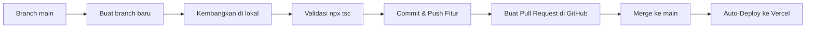

# MoodBloom Developer Setup & Collaboration Guide

Panduan ini ditujukan untuk kolaborator atau developer baru yang ingin melanjutkan pengembangan aplikasi **MoodBloom**. Ikuti langkah-langkah di bawah ini untuk menyiapkan lingkungan pengembangan lokal, menjalankan aplikasi, dan memahami alur kerja Git serta proses deploy.

---

## 📋 Prasyarat (Prerequisites)

Sebelum memulai, pastikan perangkat Anda telah terpasang:
* **Node.js** (Versi 18 ke atas direkomendasikan)
* **npm** (biasanya terinstal bersama Node.js)
* **Git** untuk manajemen repositori

---

## 🚀 1. Setup Lingkungan Pengembangan Lokal

### Langkah 1: Kloning Repositori
Jalankan perintah berikut pada terminal Anda untuk mengkloning proyek dari GitHub:
```bash
git clone https://github.com/mokhammadbahauddin/MoodBloom.git
cd MoodBloom
```

### Langkah 2: Instalasi Dependensi
Instal semua pustaka/library pihak ketiga yang didefinisikan dalam `package.json`:
```bash
npm install
```

### Langkah 3: Konfigurasi Environment Variables
Salin berkas template `.env.example` menjadi berkas lokal `.env.local`:
```bash
cp .env.example .env.local
```
Buka berkas `.env.local` baru tersebut dan sesuaikan nilai di dalamnya:
* `GEMINI_API_KEY`: Masukkan API Key dari Google AI Studio Anda untuk menjalankan fitur AI Chat dan asisten di dalam aplikasi.
* `APP_URL`: Diisi dengan `http://localhost:5173` untuk pengujian lokal.

*Catatan: Konfigurasi Firebase Anda sudah otomatis terhubung melalui berkas `firebase-applet-config.json` yang terpasang di root direktori.*

---

## 💻 2. Menjalankan & Menguji Aplikasi di Lokal

### Menjalankan Server Pengembangan (Dev Server)
Jalankan perintah berikut untuk mengaktifkan server lokal Vite:
```bash
npm run dev
```
Setelah berjalan, buka browser Anda dan akses tautan lokal yang tertera (biasanya **`http://localhost:5173`**).

### Melakukan Validasi Kode (Type Check)
Sebelum membuat commit atau push, selalu pastikan tidak ada kesalahan tipe TypeScript dengan menjalankan:
```bash
npx tsc --noEmit
```
*Pastikan tidak ada pesan error yang muncul agar proses build di produksi (Vercel) nantinya berjalan lancar.*

---

## 🔀 3. Alur Kerja Git (Git Branching Workflow)

Untuk menjaga kestabilan kode di branch utama (`main`), disarankan untuk mengikuti alur kerja pembuatan branch fitur berikut:



### Langkah 1: Buat Branch Fitur Baru
Jangan lakukan perubahan kode langsung di branch `main`. Buat branch baru dari `main` untuk fitur atau perbaikan bug tertentu:
```bash
# Pastikan Anda berada di branch main yang paling baru
git checkout main
git pull origin main

# Buat dan pindah ke branch baru (contoh: feat/optimisasi-dashboard)
git checkout -b feat/nama-fitur
```

### Langkah 2: Simpan Perubahan (Commit Lokal)
Setelah melakukan koding dan menguji di lokal, simpan perubahan Anda:
```bash
git add .
git commit -m "feat: deskripsi singkat mengenai fitur baru"
```

### Langkah 3: Push Branch ke GitHub
Kirim branch fitur Anda ke repositori GitHub:
```bash
git push origin feat/nama-fitur
```

### Langkah 4: Buat Pull Request (PR)
1. Buka halaman GitHub repositori [MoodBloom](https://github.com/mokhammadbahauddin/MoodBloom.git).
2. Anda akan melihat tombol **"Compare & pull request"** untuk branch yang baru saja di-push. Klik tombol tersebut.
3. Berikan deskripsi perubahan Anda, lalu buat Pull Request (PR).
4. Lakukan peninjauan (*code review*) jika dikerjakan bersama tim.

---

## 🌐 4. Proses Redeploy ke Produksi (Vercel)

Aplikasi ini dikonfigurasi untuk menggunakan **Auto-Deployment** via Vercel:
1. Setiap kali Pull Request berhasil disetujui (*approved*) dan **di-merge ke branch `main`**, Vercel secara otomatis mendeteksi perubahan tersebut.
2. Vercel akan memulai proses instalasi dependensi, melakukan kompilasi produksi (`npm run build`), dan melakukan pembaruan ke server hosting.
3. Dalam beberapa menit, fitur baru Anda akan langsung aktif di situs web produksi:
   👉 **[mood-bloom-nine.vercel.app](https://mood-bloom-nine.vercel.app)**

---

## ⚠️ Aturan Tambahan & Praktik Terbaik

* **Jangan Commit Berkas Sensitif**: Berkas seperti `.env.local` atau kredensial apa pun tidak boleh di-push ke GitHub. Ini sudah ditangani secara otomatis oleh aturan berkas `.gitignore`.
* **Uji Responsive Mobile**: Saat menjalankan `npm run dev`, gunakan mode *Inspect Element (Mobile Mode)* pada browser untuk memastikan tampilan responsif dan animasi transisi terasa halus di ponsel.
