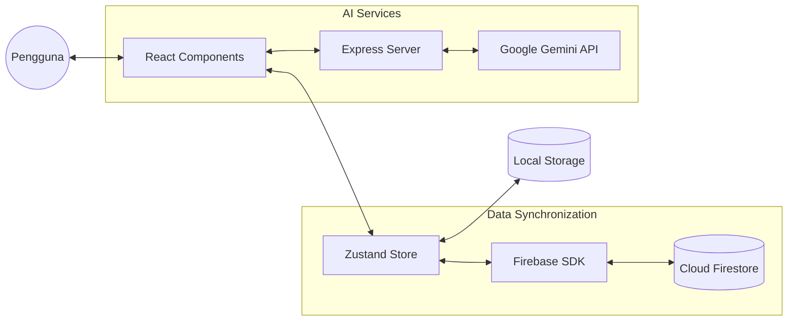

# Laporan Pengembangan Aplikasi MoodBloom

## 1. Judul Aplikasi
**MoodBloom** - *Pendamping Kesehatan Digital Mahasiswa*

## 2. Ringkasan Eksekutif
**MoodBloom** adalah aplikasi pelacak kesehatan harian yang dirancang khusus untuk mahasiswa universitas agar tetap sehat secara fisik dan mental di tengah padatnya jadwal kuliah. Aplikasi ini memiliki fitur unik bernama **Adaptive Aura**, di mana warna aplikasi akan berubah secara otomatis mengikuti perasaan atau *mood* Anda.

Aplikasi ini memudahkan Anda memantau:
*   **Target Harian (The Daily 5)**: Minum air, jumlah langkah, waktu meditasi, tugas kuliah, dan ibadah.
*   **Saran Pintar**: Memberikan masukan kesehatan otomatis tanpa harus selalu terhubung ke internet.
*   **Ruang Tenang (Zen Oasis)**: Fitur khusus untuk meditasi dengan animasi yang membantu pernapasan.
*   **Target Pengguna**: Mahasiswa yang ingin hidup lebih teratur dan mengurangi stres akademik.

## 3. Pendahuluan

### 3.1 Tujuan
MoodBloom dibuat untuk membantu mahasiswa menjaga kesehatan harian dengan cara yang menyenangkan dan mudah. Masalah yang ingin dibantu:
*   **Mencegah Kelelahan (Burnout)**: Membantu mahasiswa sadar kapan mereka butuh istirahat.
*   **Kebiasaan Sehat**: Memastikan cukup minum air dan bergerak setiap hari.
*   **Kerapihan Jadwal**: Menyatukan jadwal kuliah dengan daftar tugas agar tidak ada yang terlewat.

### 3.2 Ruang Lingkup
**Apa yang bisa dilakukan aplikasi?**
*   Mencatat minum air, langkah kaki, meditasi, tugas, dan ibadah.
*   Mengobrol dengan asisten pintar (AI) untuk curhat atau minta tips kesehatan.
*   Menyimpan data dengan aman sehingga bisa dibuka di HP atau laptop mana saja.
*   Melihat rangkuman kesehatan mingguan dalam bentuk grafik.

**Batas Aplikasi:**
*   Aplikasi ini adalah alat bantu, bukan pengganti dokter atau psikolog.
*   Butuh internet untuk menyimpan data ke awan (cloud) dan mengobrol dengan AI.

### 3.3 Latar Belakang
Banyak mahasiswa terlalu sibuk belajar sampai lupa minum atau kurang tidur. MoodBloom hadir sebagai "Oasis Digital" yang menenangkan, membantu mahasiswa tetap sehat tanpa merasa terbebani oleh aplikasi yang terlalu rumit.

### 3.4 Audiens
*   **Mahasiswa**: Pengguna utama yang ingin mengatur rutinitas.
*   **Siapa saja yang ingin hidup sehat**: Individu yang menyukai tampilan aplikasi yang bersih, modern, dan canggih.

### 3.5 Istilah Penting (Bahasa Sederhana)
*   **Adaptive Aura**: Warna aplikasi yang berubah sesuai mood (misal: ungu saat tenang, biru saat biasa).
*   **Smart Engine**: Otak kecil di dalam aplikasi yang bisa memberi saran tanpa internet.
*   **Cloud (Awan)**: Tempat penyimpanan data di internet agar data Anda tidak hilang.
*   **AI (Kecerdasan Buatan)**: Asisten pintar yang bisa diajak mengobrol seperti manusia.

## 6. Pengembangan Aplikasi

### 6.1 Arsitektur
MoodBloom menggunakan arsitektur **Local-First dengan Cloud-Sync** yang mengandalkan sinkronisasi data asinkron antara *State Management* di sisi klien dan basis data di awan.

*   **Komponen Utama**:
    *   **View Layer (React 19)**: Komponen UI deklaratif yang merespons perubahan *state*.
    *   **State Store (Zustand)**: Bertindak sebagai *Single Source of Truth* yang mengelola data aplikasi secara terpusat di memori perangkat.
    *   **Persistence Layer (Browser LocalStorage)**: Menyimpan snapshot data secara lokal agar aplikasi tetap berfungsi tanpa koneksi internet.
    *   **Sync Engine (Firebase SDK)**: Melakukan sinkronisasi data dua arah antara penyimpanan lokal dan Firestore.
    *   **AI Proxy Server (Node.js Express)**: Menangani komunikasi aman dengan Google Gemini API.

**Diagram Interaksi Komponen:**



### 6.2 Implementasi
Implementasi aplikasi menggunakan tumpukan teknologi modern yang dioptimalkan untuk performa tinggi dan skalabilitas.

*   **Bahasa Pemrograman & Kerangka Kerja**:
    *   **TypeScript**: Digunakan untuk memastikan keamanan tipe (*type safety*) di seluruh aplikasi.
    *   **React 19**: Framework utama untuk membangun UI berbasis komponen.
    *   **Vite**: Alat *build* generasi berikutnya untuk pengembangan yang cepat.

*   **Perpustakaan & Paket Utama**:
    *   **Zustand**: Manajemen status aplikasi dengan *persist middleware*.
    *   **Tailwind CSS 4**: Kerangka kerja CSS untuk desain responsif dan kustomisasi cepat.
    *   **Motion (Framer Motion)**: Pustaka animasi untuk interaksi UI yang halus.
    *   **Firebase SDK**: Layanan untuk autentikasi dan basis data *real-time*.
    *   **Lucide React**: Paket ikon vektor yang ringan.

*   **Cuplikan Kode Penting**:

    *   **Object-Oriented Programming (OOP)**: Menggunakan pola *Singleton* pada `AIService` untuk mengenkapsulasi logika bisnis yang kompleks dan menjaga *single source of truth*.
```typescript
class AIService {
  private static instance: AIService;
  private lastAnalysisTime: number = 0;

  public static getInstance(): AIService {
    if (!AIService.instance) {
      AIService.instance = new AIService();
    }
    return AIService.instance;
  }

  public async analyzeWellness(force: boolean = false): Promise<AIAnalysisResult | null> {
    const context = this.generateContext();
    try {
      const response = await fetch("/api/ai/analyze-wellness", {
        method: "POST",
        body: JSON.stringify({ context }),
      });
      return await response.json();
    } catch (error) {
      this.handleError(error, "Wellness Analysis");
      return null;
    }
  }
}
```

    *   **Functional Programming (FP)**: Menggunakan *Pure Functions* dan teknik manipulasi data seperti `filter` agar logika aplikasi bersifat *stateless* dan mudah diuji.
```typescript
// Pure Function menggunakan arrow function dan immutability
export const calculateDailyWellnessScore = (state: WellnessState, date: string): number => {
  const water = state.waterLogs[date] || 0;
  const steps = state.stepsLogs[date] || 0;

  const weights = { water: 0.5, steps: 0.5 };
  const scores = {
    water: Math.min(water / state.baseWaterGoal, 1),
    steps: Math.min(steps / state.stepGoal, 1),
  };

  return Math.round((scores.water * weights.water + scores.steps * weights.steps) * 100);
};

// Penggunaan Filter (FP) untuk mendapatkan tugas belum selesai
const pendingTasks = tasks.filter((task) => !task.completed);
```

### 6.3 Antarmuka Pengguna (UI)
Desain antarmuka MoodBloom mengusung filosofi **Aesthetic Functionalism** yang menggabungkan keindahan visual dengan kemudahan akses data.

*   **Desain**:
    *   **Bento Grid**: Tata letak kotak-kotak mandiri yang memberikan fokus visual pada setiap metrik kesehatan.
    *   **Adaptive Aura**: Sistem pewarnaan dinamis di mana latar belakang dan aksen warna aplikasi berubah secara otomatis mengikuti input mood pengguna.
    *   **Glassmorphism**: Penggunaan efek *backdrop-blur* pada kartu informasi untuk menciptakan kedalaman visual.
*   **Visual**: Tangkapan layar antarmuka dapat ditemukan di:
    *   `public/screenshot-mobile.png` (Versi Mobile)
    *   `public/screenshot-desktop.png` (Versi Desktop)

### 6.4 API yang Digunakan
Aplikasi mengintegrasikan beberapa layanan API utama untuk mendukung fungsionalitas cerdas dan keamanan data:
1.  **Google Gemini API**: Digunakan untuk analisis data kesehatan dan fitur asisten obrolan (AI Chat).
2.  **Firebase Authentication API**: Digunakan untuk manajemen identitas pengguna dan login aman.
3.  **Cloud Firestore API**: Digunakan untuk penyimpanan dan sinkronisasi data kesehatan secara *real-time*.
4.  **Google Fit API**: Digunakan untuk sinkronisasi data aktivitas fisik (langkah kaki) secara otomatis.
5.  **Web Speech API**: Digunakan untuk fitur jurnal suara (*voice journaling*) berbasis browser.

### 6.5 Infrastruktur
Lingkungan *deployment* MoodBloom dikelola sepenuhnya di atas ekosistem *cloud* untuk menjamin ketersediaan tinggi.

*   **Platform Hosting**: **Firebase Hosting**, dipilih karena dukungannya terhadap CDN global yang mempercepat pemuatan aset statis.
*   **Basis Data**: **Cloud Firestore**, database NoSQL yang menyimpan dokumen dalam koleksi secara terdistribusi. Firestore mendukung mode *offline* di mana perubahan akan disimpan secara lokal dan disinkronkan saat koneksi kembali tersedia.
*   **Autentikasi**: **Firebase Auth**, mengelola identitas pengguna melalui Google OAuth 2.0.
*   **Server Logic**: **Node.js (Runtime)** yang berjalan di lingkungan serverless untuk menangani logika API Proxy.
*   **Keamanan**: Implementasi **Firestore Security Rules** untuk validasi skema data dan pembatasan akses data hanya kepada pemilik akun yang sah.


---
*Laporan ini disusun agar mudah dipahami oleh pengguna dan pemangku kepentingan aplikasi MoodBloom.*
