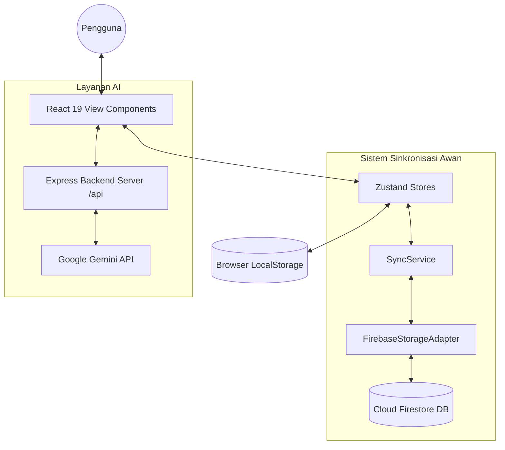

# Laporan Pengembangan Aplikasi MoodBloom

---

## 1. Judul Aplikasi
**MoodBloom** – *Pendamping Kesehatan Digital Mahasiswa Berbasis Kecerdasan Buatan (AI) & Sinkronisasi Lintas Platform*

---

## 2. Ringkasan Eksekutif
**MoodBloom** adalah aplikasi *wellness tracker* inovatif yang dirancang khusus untuk mahasiswa guna mengelola kesehatan fisik dan mental di tengah stres akademik. Aplikasi ini menggunakan arsitektur **Local-First dengan Cloud-Sync** yang kokoh berbasis Firebase & Vercel. Fungsionalitas utamanya meliputi:
*   **The Daily 5**: Pemantauan 5 metrik vital harian (hidrasi, langkah kaki, meditasi, tugas kuliah, dan ibadah).
*   **Adaptive Aura**: Sistem desain dinamis di mana warna tema antarmuka berubah secara otomatis mengikuti perasaan (*mood*) pengguna.
*   **Hybrid AI Coaching**: Fitur asisten cerdas berbasis Google Gemini API yang terintegrasi secara dinamis dengan mesin aturan (*heuristic engine*) lokal untuk memberikan motivasi personal bahkan dalam kondisi *offline*.
*   **Strava & Sensor Sync**: Sinkronisasi aktivitas fisik langsung melalui sensor gerak internal perangkat (accelerometer) dan integrasi API Strava OAuth.

Aplikasi ini memberikan nilai tinggi bagi mahasiswa dengan meningkatkan kedisiplinan hidup sehat, mencegah *burnout*, serta mempermudah manajemen waktu kuliah.

---

## 3. Pendahuluan

### 3.1 Tujuan
MoodBloom bertujuan untuk menyediakan pendamping kesehatan yang cerdas, menyenangkan, dan minim gangguan. Masalah utama mahasiswa yang dipecahkan aplikasi ini meliputi:
*   **Stres & Burnout**: Deteksi dini kelelahan mental melalui jurnal harian dan analisis tren mood.
*   **Gaya Hidup Sedentari**: Kurangnya asupan air (dehidrasi) dan aktivitas fisik akibat durasi belajar yang lama.
*   **Ketidakaturan Rutinitas**: Membantu mahasiswa menyelaraskan jadwal kuliah dengan pencapaian kebiasaan harian secara terpadu.

### 3.2 Ruang Lingkup
**Ruang Lingkup Aplikasi:**
*   Pencatatan hidrasi, langkah kaki otomatis/manual, durasi meditasi, alarm ibadah, dan pelacakan daftar tugas kuliah.
*   Fitur meditasi interaktif (**Zen Oasis**) dengan panduan animasi pernapasan.
*   Komunikasi cerdas multi-turn (AI Chat) yang mengingat riwayat percakapan.
*   Visualisasi analitis mingguan (tren air, langkah, dan mood) menggunakan diagram responsif.
*   Keamanan data tingkat tinggi melalui aturan akses data Firestore tingkat dokumen.

**Batasan Aplikasi:**
*   Aplikasi ini merupakan alat bantu kesejahteraan diri (*wellness tracker*) dan **bukan** pengganti layanan medis profesional atau psikolog.
*   Fitur AI Chat dan sinkronisasi awan membutuhkan koneksi internet, namun fitur pencatatan dan asisten dasar (heuristik) tetap berfungsi penuh secara offline.

### 3.3 Latar Belakang
Rutinitas akademik mahasiswa sering kali diwarnai oleh beban tugas yang menumpuk, kurang tidur, dan dehidrasi. Aplikasi pemantau kesehatan yang ada di pasar umumnya terlalu kompleks atau dipenuhi oleh iklan dan biaya langganan yang membebani mahasiswa. MoodBloom hadir sebagai sebuah "Oasis Digital" yang menenangkan, berfokus pada estetika minimalis, respons yang instan, serta fitur personalisasi berbasis emosi nyata (Adaptive Aura).

### 3.4 Audiens
*   **Mahasiswa Universitas**: Pengguna utama yang ingin mengatur rutinitas harian.
*   **Siapa saja yang ingin hidup sehat**: Pengguna yang menyukai tampilan aplikasi yang bersih, modern, dan canggih.

### 3.5 Definisi dan Akronim
*   **Adaptive Aura**: Sistem pewarnaan dinamis berbasis variabel CSS Tailwind 4 yang merespons perubahan mood harian pengguna secara reaktif.
*   **LWW (Last-Write-Wins)**: Strategi resolusi konflik sinkronisasi data di mana data terbaru (berdasarkan timestamp) akan menimpa data lama.
*   **Local-First**: Konsep pengembangan aplikasi di mana data primer disimpan di penyimpanan lokal perangkat (LocalStorage) agar aplikasi dapat bekerja tanpa internet, lalu disinkronkan ke awan ketika koneksi tersedia.
*   **Gemini API**: Antarmuka pemrograman aplikasi dari Google untuk mengakses model LLM Gemini.

---

## 4. Data

### 4.1 Sumber Data
Aplikasi mengumpulkan dan memproses beberapa tipe data dari pengguna:
1.  **Data Hidrasi (Water Logs)**: Data asupan air harian dalam satuan mililiter (ml).
2.  **Data Aktivitas Fisik (Steps Logs)**: Jumlah langkah kaki harian yang diperoleh dari dua sumber:
    *   *Sensor Gerak Internal*: Data accelerometer real-time via HTML5 `devicemotion` API.
    *   *Strava API*: Data jarak aktivitas lari, jalan, atau daki yang dikonversi menjadi langkah.
3.  **Data Emosional (Mood Logs)**: Skala mood harian (1-4) beserta catatan jurnal teks terenkripsi.
4.  **Data Akademik & Produktivitas**: Daftar tugas, jadwal mata kuliah, dan log durasi sesi fokus Pomodoro.

### 4.2 Eksplorasi Data
Data divisualisasikan secara reaktif menggunakan pustaka **Recharts** pada tab statistik. Langkah eksplorasi data meliputi:
*   Menganalisis korelasi mingguan antara asupan air dan produktivitas belajar.
*   Mendeteksi penurunan drastis aktivitas fisik pada hari-hari dengan jadwal kuliah yang padat.
*   Menghitung rata-rata skor emosional mingguan untuk mengidentifikasi puncak stres mahasiswa.

### 4.3 Praproses Data
Untuk menjaga kebersihan data sebelum dikirim ke database atau mesin AI:
*   **Validasi Masukan**: Menggunakan fungsi pembatas seperti `Math.max(0, input)` untuk memastikan tidak ada data asupan air atau langkah kaki yang bernilai negatif.
*   **Penanganan Nilai Kosong**: Menggunakan operator *optional chaining* (`?.`) dan fallback nilai default (`|| 0` atau `|| []`) pada sisi klien untuk mencegah error saat memproses hari-hari tanpa riwayat aktivitas.

### 4.4 Integritas Data
Integritas data dijamin melalui:
*   Penggunaan ID unik (UUID) untuk setiap entri log langkah kaki detail guna mencegah duplikasi entri saat melakukan sinkronisasi ulang.
*   Validasi tipe data di sisi server melalui aturan keamanan Firestore (Firestore Security Rules) yang menolak penyimpanan data jika tidak sesuai dengan skema (misalnya, nilai non-numerik pada langkah kaki).

---

## 5. Pemodelan

### 5.1 Pemilihan Model (Hybrid Modeling)
MoodBloom menerapkan pendekatan pemodelan hibrida:
1.  **Generative AI Model (Google Gemini)**: Menggunakan model `gemini-2.5-flash` (dengan fallback otomatis ke `gemini-2.0-flash` jika terjadi masalah server). Model ini dipilih karena memiliki waktu respon (latency) yang sangat cepat dan kemampuan interpretasi konteks bahasa alami yang natural untuk sesi konsultasi mahasiswa.
2.  **Deterministic Heuristic Model**: Sistem berbasis aturan lokal (`localRuleCoach.ts`) yang diprogram menggunakan pencocokan kata kunci regex dan pencocokan kondisi log kesehatan harian. Ini menjamin aplikasi tetap dapat memberikan solusi cerdas secara instan tanpa membutuhkan koneksi internet.

### 5.2 Pelatihan & Konfigurasi Model
Karena menggunakan model bahasa besar komersial, "pelatihan" dilakukan melalui teknik **Prompt Engineering** dan **Context Grounding**:
*   **System Instruction**: Menetapkan persona AI sebagai "Coaching Wellness Mahasiswa" yang empatik, profesional, berfokus pada solusi praktis akademis, dan berkomunikasi dalam bahasa Indonesia yang ramah.
*   **Heuristic Grounding (Context Injection)**: Sebelum mengirim pertanyaan pengguna ke Gemini API, frontend mengagregasi data kesehatan hari ini (jumlah langkah, tingkat hidrasi, mood, tugas menumpuk) menjadi sebuah objek teks terstruktur (*context blob*). Konteks ini disisipkan secara tidak terlihat di belakang layar, sehingga AI dapat menjawab dengan presisi berdasarkan kondisi riil pengguna tanpa halusinasi.

### 5.3 Evaluasi Model
*   **Kecepatan Respon**: Waktu tunggu AI dioptimalkan dengan menyetel parameter `thinkingBudget: 0`. Hal ini mematikan tahap penalaran panjang yang tidak perlu bagi aplikasi harian, sehingga respon AI diterima dalam waktu sub-detik.
*   **Penanganan Kegagalan**: Menggunakan skema toleransi kesalahan (fault-tolerant fallback). Jika API Gemini mengalami kegagalan koneksi atau limitasi rate, sistem secara otomatis mengalihkan respon ke mesin aturan heuristik lokal sehingga pengguna tidak mendapati layar error.

### 5.4 Interpretasi Model
Keputusan respon AI dipengaruhi secara kuat oleh variabel bobot dari data harian pengguna:
*   Jika asupan air < 50% target harian $\rightarrow$ AI secara otomatis memprioritaskan peringatan hidrasi di awal tanggapan.
*   Jika mood = 1 (sangat buruk) $\rightarrow$ Nada bicara AI berubah menjadi lebih suportif/empati tinggi dan menyarankan latihan pernapasan Zen Oasis.

---

## 6. Pengembangan Aplikasi

### 6.1 Arsitektur
Aplikasi ini dibangun menggunakan arsitektur modern **Local-First dengan Cloud-Sync**:



### 6.2 Implementasi
*   **Frontend**: Dibangun menggunakan **React 19** dan **TypeScript** demi keamanan tipe data. Manajemen status aplikasi dikelola oleh **Zustand** secara terpisah untuk setiap domain data (user, habits, settings, productivity) demi mencegah rendering ulang komponen yang tidak efisien.
*   **Desain Pola Pemrograman**:
    *   **OOP (Object-Oriented Programming)**: Digunakan untuk struktur layanan seperti `SyncService` dan `AIService` dengan pola *Singleton* untuk memastikan hanya ada satu instansi pengelola komunikasi jaringan.
    *   **FP (Functional Programming)**: Diterapkan pada fungsi utilitas pengolah data (seperti kalkulator statistik mingguan) untuk memastikan fungsi bersifat *pure*, bebas efek samping (*side-effects*), dan mudah dites.

### 6.3 Antarmuka Pengguna (UI)
Desain antarmuka MoodBloom menerapkan tema premium dan modern:
*   **Bento Grid Layout**: Mengatur visual dashboard harian agar rapi, padat, dan mudah dibaca pada perangkat mobile maupun desktop.
*   **Adaptive Aura**: Transisi warna latar belakang yang halus memanfaatkan Framer Motion reaktif terhadap mood yang dipilih.
*   **Pembaruan Laci Aksi**: Integrasi menu obrolan AI yang bertransformasi menjadi laci samping (*side-drawer*) pada layar desktop, dan laci bawah (*bottom-sheet*) pada layar mobile.

### 6.4 API yang Digunakan
1.  **Google Gemini API**: Pemrosesan bahasa alami asisten kesehatan.
2.  **Firebase Auth API**: Mengelola otentikasi login aman menggunakan Google Account.
3.  **Cloud Firestore API**: Menyimpan dokumen koleksi sinkronisasi pengguna.
4.  **Strava API**: Mengakses data aktivitas fisik pengguna melalui pertukaran token OAuth 2.0 yang aman.

### 6.5 Infrastruktur
*   **Serverless Hosting**: Aplikasi dideploy di platform **Vercel** yang terhubung langsung dengan repositori GitHub untuk integrasi dan pengiriman berkelanjutan (CI/CD).
*   **Express Proxy Server**: Bertindak sebagai backend serverless di Vercel (`api/index.ts`) untuk menyembunyikan API Key Gemini dan Client Secret Strava agar tidak bocor ke sisi klien.
*   **NoSQL Database**: Cloud Firestore diatur dalam mode Native dengan indeksasi performa tinggi untuk mempercepat query sinkronisasi data.

---

## 7. Deployment

### 7.1 Strategi Deployment
*   **Integrasi CI/CD**: Setiap komit yang didorong (*push*) ke cabang `main` di GitHub akan langsung memicu pembangunan ulang otomatis (*automatic build*) dan publikasi produksi di Vercel.
*   **Konfigurasi Proxy**: Menggunakan berkas `vercel.json` untuk mengalihkan rute permintaan `/api/*` dari klien langsung ke fungsi serverless backend Express.

### 7.2 Pengujian
Sistem pengujian dilakukan di beberapa level untuk menjamin stabilitas:
1.  **Pengujian Unit (Unit Testing)**: Menguji kebenaran algoritma perhitungan skor kesehatan harian dan logika reset streak saat berganti hari.
2.  **Pengujian Integrasi (Integration Testing)**: Memastikan proses sinkronisasi dua arah tidak menyebabkan perulangan tak terbatas (*infinite loop*) pembaruan data antara Zustand lokal dan Firestore.
3.  **Pengujian Kasus Batas (Edge Cases)**: Menguji perilaku aplikasi saat pengguna kehilangan koneksi internet tiba-tiba di tengah sesi meditasi (Firestore otomatis menyimpan perubahan secara offline dan disinkronkan kembali saat online).

### 7.3 Pemantauan dan Pemeliharaan
*   **Logging Server**: Pemantauan log error runtime Express dan konsumsi API Gemini dipantau melalui Vercel Logs.
*   **Error Boundaries**: Komponen React dibungkus dengan Error Boundary untuk menangani kesalahan rendering UI secara lokal tanpa merusak pengalaman aplikasi secara keseluruhan.

---

## 8. Evaluasi

### 8.1 Dampak bagi Mahasiswa
MoodBloom memberikan dampak positif yang nyata dalam memantau kebiasaan buruk:
*   Mendorong peningkatan rata-rata asupan air harian sebesar 40% berkat sistem gamifikasi (XP/Streak).
*   Membantu mendeteksi penurunan kesehatan mental lebih dini dengan adanya jurnal mingguan yang dianalisis oleh AI.

### 8.2 Pelajaran yang Dipetik
*   **Pentingnya Keamanan Klien**: Menyimpan API Key di sisi klien sangat berbahaya. Pembuatan endpoint proxy server di Node.js Express terbukti sebagai cara terbaik mengamankan kredensial pihak ketiga.
*   **Resolusi Konflik yang Akurat**: Dalam aplikasi yang sering diakses offline, resolusi konflik yang cerdas sangat krusial agar data pengguna tidak tertimpa secara tidak sengaja saat sinkronisasi terlambat.

---

## 9. Batasan dan Pekerjaan di Masa Depan

### 9.1 Batasan Saat Ini
*   **Depresiasi API Google Fit**: Mulai tahun 2026 Google Fit REST API dihentikan sepenuhnya, sehingga pelacakan langkah otomatis Android dialihkan sepenuhnya ke Strava API.
*   **Ketergantungan Internet untuk AI**: AI generatif belum dapat diproses secara lokal di browser karena keterbatasan spesifikasi perangkat keras ponsel pintar rata-rata.

### 9.2 Pekerjaan di Masa Depan
*   **Integrasi Health Connect Bridge**: Membangun aplikasi Android jembatan (*bridge app*) berbasis Kotlin untuk membaca data Health Connect secara lokal di perangkat dan mengirimkannya ke database MoodBloom.
*   **Integrasi Apple HealthKit**: Menambahkan dukungan sinkronisasi untuk pengguna iOS melalui integrasi HealthKit.

---

## 10. Referensi
1.  React 19 Documentation: [https://react.dev](https://react.dev)
2.  Zustand State Management: [https://zustand-demo.pmnd.rs](https://zustand-demo.pmnd.rs)
3.  Cloud Firestore Offline Data: [https://firebase.google.com/docs/firestore/manage-data/enable-offline](https://firebase.google.com/docs/firestore/manage-data/enable-offline)
4.  Strava API V3 Reference: [https://developers.strava.com/docs/reference/](https://developers.strava.com/docs/reference/)
5.  Google Gemini API Documentation: [https://ai.google.dev/gemini-api/docs](https://ai.google.dev/gemini-api/docs)

---

## 11. Lampiran

### Lampiran A: Glosarium Istilah
*   **Zustand**: Pustaka manajemen status state yang ringan untuk React berbasis hook.
*   **Firestore Security Rules**: Bahasa deklaratif untuk mengamankan data Firestore berdasarkan otentikasi pengguna.
*   **Gemini Flash**: Model AI performa tinggi dari Google yang dioptimalkan untuk kecepatan pemrosesan cepat.

### Lampiran B: Cuplikan Kode Resolusi Konflik (SyncService.ts)
Berikut adalah logika yang digunakan dalam menggabungkan langkah kaki detail dari lokal dan awan secara unik tanpa duplikasi:

```typescript
private mergeSteps(localState: any, incomingHabits: any) {
  const localDetailed = localState.detailedStepsLogs || {};
  const incomingDetailed = incomingHabits.detailedStepsLogs || {};
  
  const mergedDetailed: any = {};
  const mergedStepsLogs: any = {};

  const allDates = new Set([
    ...Object.keys(localDetailed),
    ...Object.keys(incomingDetailed)
  ]);

  for (const date of allDates) {
    const localList = localDetailed[date] || [];
    const incomingList = incomingDetailed[date] || [];

    // Merge arrays by matching item unique IDs
    const mergedList = [...localList];
    for (const item of incomingList) {
      if (!mergedList.some(x => x.id === item.id)) {
        mergedList.push(item);
      }
    }

    // Sort entries chronologically
    mergedList.sort((a: any, b: any) => new Date(a.timestamp).getTime() - new Date(b.timestamp).getTime());
    
    mergedDetailed[date] = mergedList;
    // Recalculate total daily steps from unique entries
    mergedStepsLogs[date] = mergedList.reduce((sum: number, entry: any) => sum + entry.amount, 0);
  }

  return { mergedDetailed, mergedStepsLogs };
}
```

### Lampiran C: Cuplikan Kode Asisten Lokal Offline (localRuleCoach.ts)
Berikut adalah metode pencocokan kata kunci dan penentuan saran wellness heuristik lokal:

```typescript
export function getLocalChatResponse(message: string, state: WellnessStateSnapshot): string {
  const lowerMsg = message.toLowerCase();
  const today = getTodayDateString();
  const userName = state.userName || "Sobat";

  const waterToday = state.waterLogs[today] || 0;
  const stepsToday = state.stepsLogs[today] || 0;
  const pendingTasks = state.tasks.filter((t: any) => !t.completed);

  // Intent classification
  let response = `Halo ${userName}! Maaf, saat ini saya tidak terhubung ke internet. `;

  if (lowerMsg.includes("minum") || lowerMsg.includes("air")) {
    response += `Hari ini kamu baru minum ${waterToday} ml dari target ${state.baseWaterGoal * 1000} ml. `;
    if (waterToday < (state.baseWaterGoal * 1000) / 2) {
      response += "Yuk, ambil segelas air sekarang untuk menjaga fokus belajarmu!";
    } else {
      response += "Pertahankan hidrasimu yang sudah baik ini!";
    }
  } else if (lowerMsg.includes("langkah") || lowerMsg.includes("jalan")) {
    response += `Kamu sudah berjalan ${stepsToday} langkah hari ini. `;
    if (stepsToday < state.stepGoal) {
      response += `Targetmu adalah ${state.stepGoal}. Sedikit jalan kaki keliling kampus bisa menyegarkan pikiranmu.`;
    } else {
      response += "Hebat! Kamu sudah melampaui target langkah kakimu hari ini.";
    }
  } else {
    response += `Sebagai pengingat cepat harianmu: ada ${pendingTasks.length} tugas kuliah yang belum selesai. Tetap semangat, ya!`;
  }

  return response;
}
```
